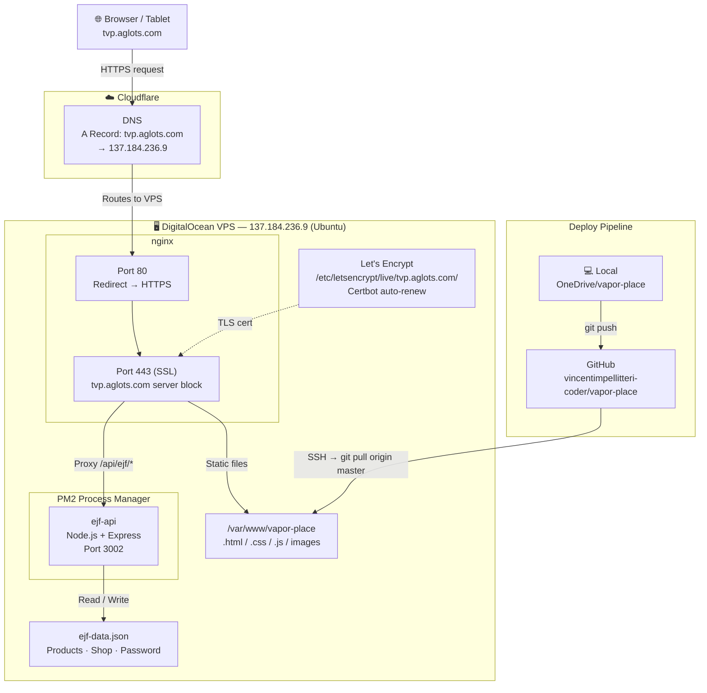

# TVP Architecture — Mermaid Diagram

```mermaid
flowchart TD
    USER["🌐 Browser / Tablet\ntvp.aglots.com"]

    subgraph CF["☁️ Cloudflare"]
        DNS["DNS\nA Record: tvp.aglots.com\n→ 137.184.236.9"]
    end

    USER -->|HTTPS request| DNS

    subgraph VPS["🖥️ DigitalOcean VPS — 137.184.236.9 (Ubuntu)"]

        subgraph NGINX_BLOCK["nginx"]
            REDIR["Port 80\nRedirect → HTTPS"]
            SSL_TERM["Port 443 (SSL)\ntvp.aglots.com server block"]
            REDIR --> SSL_TERM
        end

        SSL_TERM -->|Static files| FILES["/var/www/vapor-place\n.html / .css / .js / images"]
        SSL_TERM -->|Proxy /api/ejf/*| EJF

        subgraph PM2["PM2 Process Manager"]
            EJF["ejf-api\nNode.js + Express\nPort 3002"]
        end

        EJF -->|Read / Write| DATA["ejf-data.json\nProducts · Shop · Password"]

        CERT["Let's Encrypt\n/etc/letsencrypt/live/tvp.aglots.com/\nCertbot auto-renew"]
        CERT -. "TLS cert" .-> SSL_TERM

    end

    DNS -->|Routes to VPS| REDIR

    subgraph DEPLOY["Deploy Pipeline"]
        LOCAL["💻 Local\nOneDrive/vapor-place"]
        GH["GitHub\nvincentimpellitteri-coder/vapor-place"]
        LOCAL -->|git push| GH
        GH -->|SSH → git pull origin master| FILES
    end
```
